#Praxisbuch Neurofeedback
##Zusammenfassung von Christian Schneider

#Biofeedback und Neurofeedback
##Was ist Biofeedback?
Der Begriff  „Biofeedback“ bezieht sich auf die Rückmeldung körperlicher Prozesse, die normalerweise immer ablaufen und reguliert werden, aber nicht immer bewusst wahrnehmbar sind.
Biofeedback ist ein Prozess, der unserem Geist mithilfe von Messinstrumenten zusätzliche Informationen über Körperprozesse liefert und so Körper und Geist verbindet. Mit etwas Übung können wir lernen, die rückgemeldeten Körperprozesse, später dann auch ohne Geräte, besser zu regulieren. Diese Hilfe zur verbesserten Selbstregulation psychischer und physischer Prozesse kann in vielen Fällen ein wichtiger Bestandteil zur Lösung gesundheitlicher Probleme sein. Das Beispiel „Spannungskopfschmerz“ soll die Zusammenhänge ver- deutlichen (Abb. 1.1).

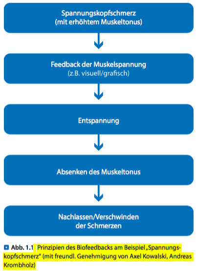

###Feedback
Feedback ist die Voraussetzung für jede Art von Lernen. Wir brauchen für alles, was wir lernen wollen, eine Rückkopplung (= Feedback) zwischen dem Gewollten und dem Erreichten.
Durch Biofeedback bekommt das Gehirn zusätzliche Si- gnale über Körperfunktionen und kann so lernen, diese besser zu regulieren. Schließlich ist unser Gehirn darauf spezialisiert, Reize zu empfangen und diese als Informa- tion in entsprechende Regelkreise einzubringen, um so die Funktionsfähigkeit zu optimieren (. Abb. 1.3).

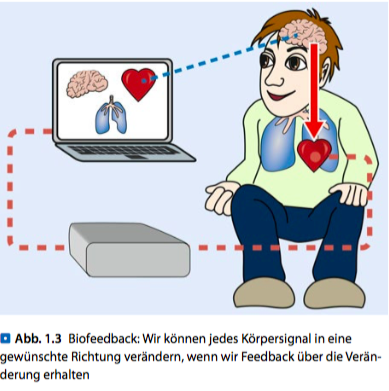

##Was ist Neurofeedback?
Neurofeedback ist das Feedback von Gehirnaktivität, gemessen im EEG. Um das Potenzial von Neurofeedback zu verstehen, ist es zunächst sinnvoll, sich darüber Gedanken zu machen,

-welche Aufgaben das Gehirn hat,
-wie es organisiert ist, und
-was im EEG gemessen werden kann

Deshalb sollen an dieser Stelle zunächst einige Grundlagen zur Funktionsweise des Gehirns zusammengefasst werden. Grundlegende Kenntnisse über die Gehirnfunktionen sind für ein erfolgreiches Neurofeedbacktraining essenziell.

###Aufgaben des Gehirns
Die primäre Aufgabe unseres Gehirns ist es, angemessen auf unsere Umwelt zu reagieren, um im biologischen Sinne die besten Überlebenschancen zu haben. Dazu nimmt das Gehirn ständig eine Unmenge von Informationen, sowohl aus der Umwelt als auch aus dem eigenen Körper wahr.

Diese Fülle von Informationen muss das Gehirn sinnvoll verarbeiten, muss entscheiden, welche Informationen wichtig sind und welche unwichtig. Die Wichtigen müssen bewertet und aus dem Hintergrundrauschen herausge l- tert, verstärkt und weiterverarbeitet werden. Das geschieht sowohl auf chemischem als auch auf elektrischem Weg. Danach richten sich dann unser Verhalten, die Emotionen, das Denken und Handeln. Eine sinnvolle Informations- verarbeitung im Gehirn und damit die Funktionsfähigkeit hängen allerdings entscheidend von dem Erregungslevel im Gehirn ab (. Abb. 1.4). Sowohl Zustände zu niedriger Erregung als auch zu hoher Erregung unterbinden höhere Hirnfunktionen.

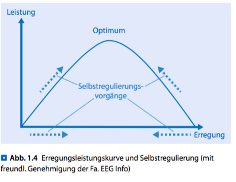

Deshalb ist es eine der wichtigsten Aufgaben für das Gehirn, ständig die feine Balance zwischen Erregung und Hemmung von Erregung zu halten. Dies gilt auf zellulärer Ebene genauso wie auf Netzwerkebene und für das gesamte Gehirn. Das Gehirn verwendet sogar die meiste Energie darauf, seinen eigenen Erregungszustand zu regulieren. Im Vergleich zum Ruhezustand erhöht das Gehirn seinen Energiebedarf beim Lösen einer kognitiven Aufgabe gerade mal um 3 %.

Viele Pathophysiologien im Gehirn sind als Fehlregulierungen in dieser Balance zwischen Erregung und Hemmung von Erregung und den entsprechenden Netzwerkverschaltungen zu verstehen.

###Bau und Organisation des Gehirns
Die vertikale anatomische Anordnung des Gehirns entspricht mehr oder weniger auch dem Organisationslevel im Gehirn:

-Die komplizierteren geistigen Prozesse laufen eher in den oberen Regionen ab,
-die unteren Abschnitte sind eher für die Regulierung der Vitalfunktionen zuständig.

####Vertikale Organisation
Zum besseren Verständnis von Neurofeedbacktrainingsef- fekten macht es Sinn, sich den vertikalen Au au des ZNS etwas zu vereinfachen (. Abb. 1.5).

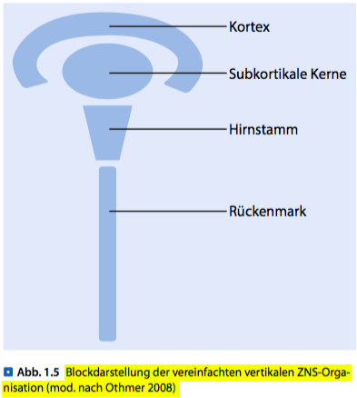

#####Kortex
Der Cortex cerebri (Großhirnrinde) stellt wie die Rinde ei- nes Baums, die äußere Struktur des Gehirns dar. Er besteht aus 6 Schichten (. Abb. 1.6), trotzdem ist er nur 2–3 mm dick. Damit mehr Zellen in dem eng begrenzten Raum un- tergebracht werden können, ist der Kortex stark gefaltet angeordnet. Dadurch ergeben sich auch die typischen Win- dungen und Furchen. Würde man die Gehirnrinde ganz au alten und  ach ausbreiten, ergäbe das ungefähr eine Fläche von 2 m2. Der Kortex besteht aus grauer Substanz, die sich farblich von der weißen Substanz darunter abhebt. Über die Anzahl der Neuronen im Kortex gibt es keine genauen Angaben, Schätzungen gehen von 10–50 Mrd. Nervenzellen aus.

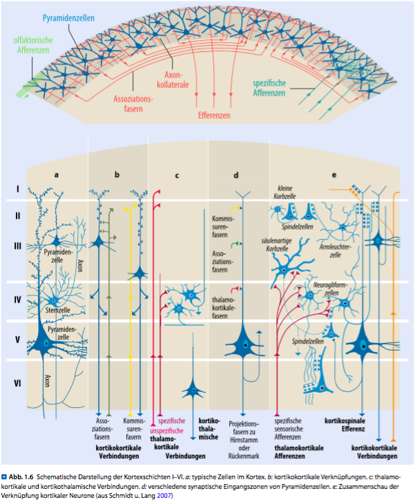

Alle Prozesse, die unter dem Begri  kognitive Pro- zesse zusammengefasst sind, werden durch das Kommu- nizieren der Neurone im Kortex möglich, z. B. Denken, Planen, Problemlösen etc. Auch Charaktereigenscha en oder das Bewusstwerden und Regeln von Emotionen eines Menschen benötigen neuronale Kommunikation.

#####Subkortikale Kerne (Nuklei)
Direkt unterhalb des Kortex  nden sich viele funktionale Einheiten, die aus Ansammlungen vieler Nervenzell- körper bestehen. Das sind die sog. subkortikalen Kerne oder Nuklei. Ihre Axone (▶ Abschn. 1.2.3, „Nervenzellen“) projizieren in andere Gehirnbereiche, wie z. B. zu anderen Nuklei, nach kranial zum Kortex oder nach kaudal in den Hirnstammbereich. Die Verbindungsfasern zu anderen Bereichen erscheinen als weiße Substanz, die sich farblich von den grauen Bereichen der Nervenzellkörper abgrenzt.
Es gibt viele spezi sche subkortikale Bereiche, die an der Verarbeitung sensorischer, motorischer und lim- bischer Funktion beteiligt sind. Diese tieferen Teile des ZNS haben großen Ein uss auf unser Verhalten, obwohl diese Steuerung meist unter der Schwelle der bewussten Wahrnehmung bleibt.

#####Hirnstamm
Der tiefer gelegene Hirnstamm reguliert grundlegend un- sere Vitalfunktionen. Er leitet Informationen von und zum Rückenmark weiter und kontrolliert unseren grundlegen- den Erregungslevel sowie die Schlaf-Wach-Zyklen.

#####Rückenmark
Das Rückenmark gehört auch zum ZNS. Es zieht sich hi- nunter bis in den untersten Teil der Wirbelsäule und ist von denselben Häuten umgeben wie das Gehirn. Im Rü- ckenmark werden ein- und ausgehende Informationen von und in den Körper verschaltet. Einige Informationen werden auch auf diesem Level koordiniert (z. B. einfache Re exkreise).

####Funktionelle Anatomie
#####Zusammenspiel der verschiedenen Ebenen
Es gibt wohl keinen Bereich im Gehirn, der für sich al- leine arbeitet. Alles was wir wahrnehmen, fühlen, denken, handeln ist immer ein komplexes Zusammenspiel verschiedener Netzwerke und verschiedener Gehirnbereiche.

Im **Rückenmark** kommt die sensorische Information aus der Körperperipherie im Hinterhorn an und wird dann zur Verarbeitung an höhere Level in Richtung Gehirn wei- tergeleitet. Im Vorderhorn verlassen die ausgehenden In- formationen, z. B. Motoneurone, das Rückenmark. Einige Funktionen werden direkt auf Rückenmarksebene koor- diniert, bei anderen sind durch die Top down-Kontrolle höhere Gehirnebenen involviert.

Der **Hirnstamm** ist an der Verarbeitung sensorischer Information beteiligt und kontrolliert zu großen Teilen den auf die Umwelt orientierten motorischen Output. Vor allem die Formatio reticularis, ein langgestrecktes Netz- werk im Hirnstamm, verarbeitet sensorischen Input (z. B. aus den Sensoren von Haut, Muskeln oder Gelenken) und moduliert Informationen von und zum Kortex. Die For- matio reticularis hat großen Anteil an der Regulierung des vegetativen Nervensystems (Bottom up-Kontrolle) und der lebenswichtigen Vitalfunktionen wie Atmung, Herzschlag und Schlaf-Wach-Rhythmus.

Die **subkortikalen Kerne** müssen die einkommende Information in Hinblick auf Gefahr und mögliche schnelle Reaktionen abschätzen, um uns am Leben zu erhalten. Diese Überlebensreaktionen sind sehr viel schneller als die detaillierte Analyse des sensorischen Inputs auf kortika- ler Ebene. Sie haben in der Informationsverarbeitung den Vorrang. Die subkortikalen Kerne beinträchtigen unsere Wahrnehmung und unser Verhalten enorm.

Der **Kortex** analysiert den sensorischen Input detailliert und wählt einen adäquaten Verhaltensoutput. Eine gute kortikale Kontrolle („top down“) erlaubt uns überlegtes Handeln.

#####Erregung und Aktivierung
Erregung und Aktivierung sind Schlüsselkomponenten in der Zustandsregulierung.

In erster Linie ist der **Hirnstamm** für den ge- nerellen Erregungslevel zuständig. Subkortikale Kerne (wie z. B. der  alamus oder die Basalganglien) kontrol- lieren dann die Aktivierung spezi scher Gehirnareale, die für die entsprechende Funktion zuständig sind. Das heißt, diese spezialisierten Bereiche machen sich bereit, sensorischen Input aufzunehmen und angemessen darauf zu reagieren. Die Frage, wie sich das Gehirn für die Aktivierung bestimmter Areale bereit macht, führt zum limbischen System.

Das **limbische System** reguliert Antrieb und Emotionen. Dadurch wissen wir, was wir zum Überleben brauchen, es lenkt unsere Wahrnehmung, unser
Verhalten und unsere physiologische Regulation auf der Suche nach Sicherheit und Belohnung. In der limbischen Funktion sind vor allem subkortikale Kerne involviert, die sehr schnell Gefahr und Belohnung einschätzen und uns, um zu überleben, schnell reagieren lassen. Der Hirnstamm gibt den emotionalen Grundtonus vor und der Kortex die bewussten Ziele und Pläne. Die limbische Funktion ist überlebenswichtig, kann aber zum Problem werden, wenn sie außer Kontrolle gerät.  
Man kann sich das am Beispiel der posttraumatischen Belastungsstörung klarmachen: In einer lebensbedrohlichen Situation wird ein lebenserhaltendes Verhalten ge- lernt, das dann aber noch lange, nachdem die bedrohliche Situation vorüber ist, beibehalten wird. Das führt dazu, dass Personen mit einer posttraumatischen Belastungs- störung auf ihre Umwelt weiterhin so reagieren, als wäre sie lebensbedrohlich. Diese Patienten sind dann nicht in der Lage, ihre unbewussten, inadäquaten Reaktionen zu hemmen, obwohl sie bewusst verstehen, dass diese heftigen, unangemessenen Reaktionen nicht mehr gebraucht werden.

**Präfrontaler Kortex**: Die inhibitorische (hemmende) Kontrolle ist ein weiterer wichtiger Faktor in der Zusammenarbeit verschiedener Organisationslevel im ZNS. Kortikale Bereiche haben hemmende Kontrolle über niedrigere Gehirnregionen und deren automatisierte Reaktionen. Dies verscha  die nötige Zeit für die detaillierte Analyse sen- sorischer Information. Dadurch können die verschiedenen Prioritäten und die möglichen Konsequenzen des eigenen Handelns in Betracht gezogen werden, bevor die Reaktion auf die sensorischen Reize ausgeführt wird. Der präfron- tale Kortex ist der höchste Level in der Organisation der inhibitorischen Kontrolle des ZNS. Gute präfrontale Kontrolle ist essenziell für Selbstkon- trolle und überlegtes Handeln.

###Computational Neuroscience
Computational Neuroscience ist noch eine recht junge Forschungsdisziplin, die versucht, Experiment und  eo- rie zu verbinden. In interdisziplinärer Zusammenarbeit mit Biologen, Medizinern, Physikern, Mathematikern, Pro- grammierern und Ingenieuren werden in Computermo- dellen neuronale Prozesse simuliert und nachgebildet, um die Funktionsweise des Gehirns besser zu verstehen. Durch die stetige Weiterentwicklung bildgebender Verfahren sowie die ständig verbesserten Möglichkeiten der Datenanalyse durch leistungsstarke Computer erö nen sich stetig neue Chancen, die Funktionsweise und Fehlregulationen des Gehirns auf Netzwerkebene zu erforschen. Dieser For- schungszweig wird in den nächsten Jahren ho entlich noch viele Erklärungen bringen, warum neuromodulatorische Methoden wie das Neurofeedback die Selbstregulationsfä- higkeit des komplexen Systems „Gehirn“ so effektiv fördern können. 

###Die Entdeckung des Elektroenzephalogramms
####Die erste Annäherung an das EEG
**Richard Caton** (1842–1926) war Arzt und praktizierte seinerzeit in Liverpool. Er untersuchte als Erster die elek- trische Aktivität an der freigelegten Großhirnrinde von Hasen und A en. Dabei entdeckte er „schwache Ströme mit wechselnder Richtung“, wenn er beide Elektroden an der Schädelober äche platzierte oder eine Elektrode auf der freigelegten grauen Substanz und eine auf der Schädel- ober äche. Diese schwachen Ströme waren wohl damals noch durchsetzt mit großen Artefakten, dennoch gaben Catons’ Arbeiten die ersten Hinweise darauf, dass an der Schädelober äche schwankende Potenziale zu messen seien. Seine ersten Arbeiten wurden später auch von Hans Berger zitiert.

####Hans Berger: Die Entdeckung des menschlichen EEGs
**Hans Berger** (1873–1941), ein deutscher Psychiater, star- tete seine ersten EEG-Experimente zunächst wie seine Kollegen mit der Untersuchung des EEGs an Tieren. Seine Forschungen über das menschliche EEG begannen 1920. Er bestellte viele Patienten mit o enen Schädelverletzungen in sein Labor. Damals, nach Ende des 1. Weltkriegs, standen viele solcher Patienten zur Verfügung. Berger er- kannte jedoch, dass die Messungen an Patienten mit offenen Schädeldecken nicht zwangsläuffig bessere Messergebnisse brachten als Messungen an der Schädeloberfäche.  
In seiner ersten Publikation über das menschliche EEG beschreibt Hans Berger 1929 den als Berger-E ekt bekannten Alpha- Block: Bei geschlossenen Augen dominiert im posterioren EEG der Alpha-Rhythmus. Er ist schon im rohen EEG recht gut an seiner typischen Spindelform und der Fre- quenz zwischen 8–10 Hz zu erkennen. Dieser Rhythmus wird unterbrochen, sobald der Proband die Augen ö net und visuellen Input verarbeitet. Dann werden die Alpha- Wellen durch kleinere und schnellere (15–23 Hz) Betawel- len abgelöst (. Abb. 1.18). Der Alpha- oder Berger-Block ist individuell unterschiedlich stark ausgeprägt.
Trotz akribischer wissenscha licher Experimente wa- ren Bergers Ideen über die „psychische Energie“ in der wissenscha lichen Welt nicht ganz unumstritten. Nichts- destotrotz waren seine EEG-Experimente wegweisend für die Neurowissenschaften.

###Was wird mit dem EEG gemessen?
####Ursprung des EEG-Signals
Wesentlich verantwortlich für das schwache elektrische Signal, das im EEG messbar ist, sind die Nervenzellen im Kortex, die als Pyramidenzellen bekannt sind. Sie heißen Pyramidenzellen, weil ihr Zellkörper im Schnittbild an die Form einer Pyramide erinnert. Es sind relativ große Nervenzellen, im Kortex sind sie am häufigsten vertreten. Die apikalen Dendriten empfangen wie Antennen exzitatorischen Input, v. a. von unspezifischen thalamischen Kernen sowie Kommissuren und langen A erenzfasern (. Abb. 1.19). Die inhibitorischen Synapsen finden sich eher an Dendriten in Soma-(Zellkörper-)Nähe. Für das EEG-Signal entscheidend sind die elektrische Aktivität der apikalen Dendriten und die senkrechte Anordnung der kortikalen Module.

Dieser **Stromfluss um die Zelle**, senkrecht zur Oberfläche des Gehirns wird nun im EEG mit einer Auslenkung der Kurve nach oben sichtbar, d. h., eine negative Auslenkung im EEG steht für eine Erregung im Kortex. Allerdings würde es nicht ausreichen, wenn nur an einer einzigen Zelle eine derartige Umkehrung der Potenzialdi erenz au reten würde. Das Signal wäre viel zu schwach, um an der Schädelober äche registriert zu werden. Daher müssen mehrere 1000 Neuronen synchron dieselbe Veränderun- gen zeigen, d. h. zum selben Zeitpunkt erregt werden; hier man spricht von Makrorhythmen.

####Rhythmen im EEG
Das Ausmaß der Aktivierung bzw. Aktiviertheit des Kortex (der Neurone) spiegelt sich in verschiedenen Ge- schwindigkeiten wider, in denen die Potenzialverschiebun- gen statt nden. Man spricht hier von Frequenzbändern, in die sich das EEG mathematisch mittels der Fast-Fou- rier-Transformation zerlegen lässt. Grundsätzlich kann das Signal in 4 Hauptfrequenzbänder zerlegt werden, die sich dadurch unterscheiden, wie o  pro Sekunde eine Erregung der Neurone ausgedrückt durch einen Ausschlag im EEG statt ndet. Die Schwingungen im EEG werden in Hertz (Hz) angegeben (. Abb. 1.21).

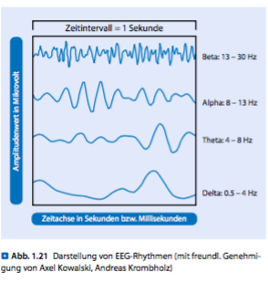

Je nach Bewusstseinslage dominieren unterschiedli- che Frequenzen das EEG, d. h., der Anteil eines Bandes am Gesamt-EEG variiert (. Tab. 1.2). Das Dominieren eines Frequenzbandes kann man sich vorstellen wie das Abwechseln der Lautstärke verschiedener Instrumente in einem Orchester. So ist z. B. in einem entspannten Wachzustand das Alpha-Band dominant, während das Beta-Band immer dominant ist, wenn eine Person mental aktiv ist. Im Tiefschlaf dominiert das Delta-Band, beim Dösen das  eta-Band. Bildlich gesehen gibt die FFT also die Laut- stärke eines Instruments zu einem Zeitpunkt innerhalb des Gesamtorchesters an. Während die klassischen Fre- quenzbänder (Alpha, Beta,  eta, Delta) den Erregungs- level des Gehirns widerspiegeln, hängen die langsamen Potenzialschwankungen (Frequenzen <0,1 Hz) eher mit der Erregbarkeit zusammen, d. h., wie bereit sind die neuronalen Netzwerke überhaupt, in Aktion zu treten? Um bei dem Vergleich mit dem Orchester zu bleiben, könnte man das mit dem richtigen Einsatz vergleichen: Wann ist wer dran, und wie wissen die jeweiligen Stimmen, wann sie die Lautstärke ändern sollen.

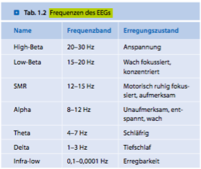

##Können alle Hirnstrukturen über Neurofeedback beeinflusst werden?
Durch das Feedback der eigenen EEG-Aktivität wird die Wahrnehmung der internen Zustände verbessert. Das fördert die Selbstregulation, was wiederum die Gehirnfunktion verbessert. Unser Gehirn ist immer bestrebt, uns am Leben zur erhalten und optimal zu funktionieren. Allerdings sind wir oft in Fehlfunktionen gefangen.
Das Ziel von Neurofeedback ist es, die Muster der Fehlregulierung zu durchbrechen und das Gehirn wieder in einen besseren Funktionszustand zu bringen.
Das ZNS ist ein komplexes Netzwerk von Milliarden von Nervenzellen mit Billionen von Verknüpfungen. Es besteht aus verschiedenen funktionalen Ebenen, die vom Kortex absteigend über die verschiedenen subkortikalen Struktu- ren, zum Hirnstamm und bis zum Rückenmark reichen. Obwohl beim Neurofeedback nur die elektrische Aktivität der oberen Kortexschichten gemessen und rückgemeldet wird, können durch die komplexe Verknüpfung der verschiedenen Bereiche auch größere Netzwerke inklusive der subkortikalen und Hirnstamm- bereiche trainiert werden.

#Methoden und Durchführung der Therapie
##Frequenzbandtraining
###Entwicklung des Frequenzbandtrainings
Viele Forscher haben schon vor langer Zeit herausgefunden, dass sie Funktionen ihres Körpers und ihres Gehirns mithilfe von Rückmeldungsmechanismen beeinflussen können. Schon vor 70 Jahren zeigten Jasper und Shagass (1941), dass die klassische Konditionierung des EEGs möglich ist, indem sie den Berger-Effekt mit einem auditiven Stimulus verknüpfen.
Die Geschichte der Entwicklung von Biofeedback und -Neurofeedback verlief zweigleisig: Auf der einen Seite entffaltete sich

-das Alpha-Training und entwickelte sich in eine eher
humanistisch-psychologische Richtung,
-während SMR- und  Theta-/Beta-Training sich in neuro- physiologisch-medizinischen Ansätzen wieder fanden.

####Joe Kamiya: Anfänge des Alpha-Trainings
Es war 1966, als Joe Kamiya, ein Schla orscher an der Uni- versität von Chicago, im Schla abor EEGs überwachte. Er kam auf die Idee, jedes Mal, wenn er Alpha-Spindeln im EEG der Probanden sah, eine Glocke zu läuten und so die Leute auf ihren Alpha-Zustand aufmerksam zu machen. Bald konnten die Probanden sagen, ob sie Alpha-Wellen produzierten oder nicht, und sie waren auch in der Lage, schnellere Alpha-Wellen zu erzeugen. Kamiyas Artikel „Conscious control of brain waves“, der 1968 in Psychology Today verö entlicht wurde, stieß auf großes ö entliches Interesse, und bald begannen alle mög- lichen Geschä emacher und Esoteriker Alpha-Training als „Instant-Nirvana“ anzupreisen – eine Reaktion, die Neuro- feedback damals einen schlechten Ruf einbrachte und die wissenscha liche Akzeptanz zunächst emp ndlich störte.

####Elmer und Alyce Green: Alpha- und Theta-Training
Elmer und Alyce Green arbeiteten in der Menninger Clinic in Topeka, Kansas und führten dort viele Versu- che mit **Handerwärmungstraining**, **Alpha- und Alpha-Theta-Training** durch. Über 20 Jahre reisten sie weltweit und unterrichteten Biofeedback und Selbstregulations- techniken. 1969 war Elmer Green einer der Mitbegrün- der der Biofeedback Research Society, die heute als As- sociation for Applied Psychophysiology and Biofeedback (AAPB) bekannt ist. Zusammen mit seiner Frau unter- suchte er Yogis, Medizinmänner, Schamanen und Heiler. 1977 wurde Alyce und Elmer Greens Buch „Beyond Biofeedback“ verö entlicht, in dem sie ihre Erfahrungen beschrieben.

Elmer Green propagiert in einem Buch Theta-Training und sagt darüber: „Theta Training ist wie eine Tür, die man Dir zeigt. Die Arbeit des Hindurchgehens musst Du leisten, und das EEG-Gerät ist der Türgriff.“ In einem Interview, das er 2011 als 94-Jähriger gab, empfiehlt er Theta-Training, indem er sagt: „Wenn Du Theta trainierst, dann ist es für Dein Höheres Selbst möglich, mit Dir zu sprechen. Denn um  eta zu produzieren, musst Du Deinen Geist beruhigen und Deinen Gedanken befehlen, eine Zeitlang still zu sein. Und sobald Dein Geist ruhig wird, wird der nächste Bereich aktiv, der Traumlevel beginnt zu Dir zu sprechen, und Du musst in der Lage sein, ihm zuzuhören, ohne einzuschlafen.“

Es wichtig, dass ein Theta-Training nur dann durchgeführt wird, wenn sichergestellt ist, dass seitens des Trainingsanleiters genügend Fachwissen vorhanden ist, um mit plötzlich auftauchenden negativen Erinnerungen umzugehen.

####Alpha-Theta-Training
#####Peniston: Alpha-Theta-Training bei posttraumatischer Belastungsstörung und bei Sucht
Peniston, ein Psychologe, der sein Training in der Mennin- ger Clinic in Topeka, Kansas bei Elmer Green absolvierte, arbeitete mit Vietnamveteranen, die an PTBS (posttrau- matischer Belastungsstörung) litten.
Bei diesen Veteranen zeigten sich neben Symptomen wie Angst und Panikstörungen, Alkoholismus, Suizidge- danken, Feindseligkeit und Reizbarkeit auch Eheschwierig- keiten. Untersuchungen ergaben, dass bei den Veteranen, die extreme Kamp andlungen erlebt hatten, das Vorkom- men psychologischer Probleme höher war. Sie berichteten nicht nur von andauernden Ängsten, sondern wurden auch von wiederkehrenden Alpträumen heimgesucht, von Flashbacks, Panikattacken und lebha en Erinnerungen an Extremsituationen im Kampf.
Bei seiner ersten Studie trainierte Peniston 14 Veteranen, die neben Handerwärmungstraining, Atemübungen und Anleitungen zum Autogenen Training zusätzlich zu Ge- sprächen auch noch ein Alpha-/ eta-Trainingsprotokoll absolvierten. Die Kontrollgruppe mit 15 Veteranen erhielt nur die herkömmliche Gesprächstherapie. Beide Gruppen waren medikamentös eingestellt.

Alpha-Theta-Training erlaubt verdrängten Inhalten/ Erinnerungen, sich wieder zu zeigen, so dass sie verar- beitet werden können.

Die Alpha- (8–12 Hz) und Theta- (4–8 Hz) Amplituden werden in einer Baseline (über 5 Minuten) bestimmt und dann so einge- stellt, dass bei Überschreiten der Baseline-Schwelle das auditive Feedback hörbar wird.
Der Ton für Theta wird tiefer eingestellt als der für Alpha. Der Patient soll durch Entspannung versuchen, die Töne so lange wie möglich zu hören.
Erwünscht wird ein Zustand, bei dem ein Crossover von Theta und Alpha statt ndet, bei dem die Amplitude von Theta die von Alpha übersteigt.
Das Feedback für Alpha wird bei 70–80 % eingestellt, das für Theta bei 20–30 %.
Nach der Sitzung bespricht der Patient mit dem Therapeuten seine Erlebnisse.

Heilend wirkt nicht das Neurofeedbackprotokoll, sondern der Kontakt mit inneren Ressourcen, der durch das Training möglich wird.

Alpha-Theta-Training ist auch bei schwierigen Patien- tengruppen mit Modi kationen des Trainingsproto- kolls erfolgreich, besonders im Suchtbereich.

Man muss aber nicht an PTBS leiden, um von Alpha-Theta- Training zu profitieren.

#####Alpha-Theta-Training als Hochleistungstraining
Schon vor Jahren schrieb Elmer Green über den traumähnlichen Theta-Zustand, der einen Zugang zum Unbewussten ermöglicht. Es ist bekannt, dass viele Forscher in diesem Stadium zwischen Traum und Realität bahnbrechende Ideen bekamen oder Lösungen für Probleme fanden, mit denen sie sich schon lange beschä igt hatten. Kritische, realistische Überlegungen machen es schwer, kreativ zu sein. Im  eta- Zustand jedoch können neue und ungewöhnliche Inhalte ungehindert von „realistischen Einwänden“ au auchen.
Solche Überlegungen haben dazu geführt, dass das Alpha- eta-Training auch bei Künstlern wie Sängern, Musikern und Tänzern mit Erfolg durchgeführt wurde. Doch man muss kein Künstler sein, um seine Leistungen durch Bio- und Neurofeedback zu verbessern. Die meisten Patienten möchten einfach in ih- rem täglichen Leben, bei ihrer Arbeit und in ihrer Freizeit besser zurechtkommen und sich besser fühlen. Hier kann Alpha- eta-Training eine effektive Hilfe sein.

####Barry Sterman: Die Entdeckung des SMR-Trainings und Epilepsie
Ganz im Gegensatz zu Green verfolgten Sterman, Lubar, Monastra und ihre Nachfolger die medizinische Richtung und leiteten ihren Ansatz aus neurophysiologischen Forschungen ab.

Barry Sterman arbeitete als Professor für Neurophysiologie an der University of California (UCLA) und befasste sich hauptsächlich mit Schla orschung. Dabei trainierte er mit Katzen und zeigte, dass diese lernen konnten, die Amplitude eines bestimmten Frequenzbandes (12–15 Hz) zu erhöhen. Sterman nannte dieses Frequenzband „SMR“, sensomotorischer Rhythmus, weil es über dem motori- schen Kortex abgeleitet werden konnte, wenn die Katzen motorisch ruhig waren.

SMR-Training erhöht die Schwelle für epileptische Anfälle.

####Vincent Monastra: Der Theta-Beta-Quotient
Der Psychologe Vincent Monastra untersuchte Kinder mit Aufmerksamkeitsstörungen und zeigte, dass diese Kinder einen erhöhten Theta-Beta-Quotienten hatten. Im Ver- gleich zu anderen Kindern waren bei ihnen die Amplitu- den der  Beta-Wellen erhöht, während die Amplituden der Beta-Wellen erniedrigt waren.

####Ros: SMR als Training für Chirurgen
Neurofeedback kann verwendet werden, um die Leistungen von gesunden Menschen zu verbessern. Es wurde untersucht, wie sich die chirurgischen Fertigkeiten von angehenden Augenärzten durch SMR-Training verbessern liessen.

#####Vorgehen: SMR-Theta-Training von Ros
Der Trainierende sitzt in einem bequemen Stuhl, etwa 1,5 m vom Bildschirm entfernt. Zuerst wird bei o enen Augen an Cz die Base- line über 3 Minuten gemessen. Mit diesen Werten werden dann die Schwellenwerte berechnet, und zwar so, dass für die Schwelle von SMR (12–15 Hz) der entsprechende Wert mit 0,8 multipliziert wird, für das Theta (4–7 Hz) und das High-Beta-Inhibit (22–30 Hz) wird mit 1,2 multipliziert. Immer, wenn es dem Trainierenden ge-  lingt, seine SMR-Amplitude zu erhöhen, ohne dass gleichzeitig Theta und High-Beta mitgehen, bekommt er Punkte. Gleichzeitig wird über ein EMG-Inhibit (40–70 Hz) verhindert, dass Belohnungen für Muskelspannungen vergeben werden.

Es stellte sich heraus, dass das Alpha-Theta-Training zwar kleine Erfolge in Technik und Schnelligkeit brachte, aber SMR-Training war deutlich überlegen. Die Ärzte operierten nicht nur um 26% schneller, sondern auch behutsamer. Im Vergleich zu der Kontrollgruppe gab die SMR- Gruppe nach dem Training weniger Ängstlichkeit an.

####Davidson und Rosenfeld: Alpha-Training bei Depression
Das Alpha-Asymmetrietraining bringt die beiden Ansätze, den humanistisch-psychologischen und den neurophysiologisch-medizinischen Ansatz wieder zusammen. Ganz eindeutige neurophysiologische Messungen zeigen den Ein uss von Emotionen auf unser Leben. Trainingsme- thoden wie Alpha-Training, die eher in die Richtung von Selbsterkenntnis und Persönlichkeitsstabilisierung gehen, werden nun wissenscha lich untermauert.  
Untersuchungen von Davidson (1990, 1998) zeigen, dass eine rechtsfrontale Aktivierung, die sich in einer re- duzierten Alpha-Amplitude äußert, die Aktivierung eines Vermeidungs- und Rückzugssystems repräsentiert und mit negativen Gefühlen verbunden ist.  
Davidson ist Professor für Psychologie und Psychiatrie und forscht an der Universität von Wisconsin im Labor für a ektive Neurowissenscha . In seinem Buch „ e emotio- nal Life of your Brain“, das er im März 2012 verö entlichte, beschreibt er den emotionalen Stil („emotional style“), der bestimmt, wie ein Mensch durchs Leben geht.  
Dieser emotionale Stil hat neurophysiologische Wurzeln, die neben anderen neurophysiologischen Besonder- heiten in der unterschiedlichen Aktivierung der beiden frontalen Gehirnhäl en zu  nden sind. Seine Forschungen zeigen, dass die linke Gehirnhälfte eher mit positiven Ge- fühlen, schönen Erinnerungen und einem auf das Leben zugehenden Verhalten zu tun hat, während die Verarbeitung negativer Emotionen eher in der rechten Gehirnhälfte statt-  ndet. Hier  ndet man eher Verhaltenweisen wie Grübeln, sich Sorgen machen und sich ängstlich zurückzuziehen.  
Befindet sich nun die linke Gehirnhälfte in einem Zustand erhöhter Alpha-Aktivität, dann kann man das gleichsetzen mit einer geringeren Verarbeitung, da Alpha eher als Leerlauf (▶ Exkurs „Der Thalamus und Alpha-Wellen“) bezeichnet werden kann. Positive Gefühle oder Informationen werden nicht richtig wahrgenommen, weil sich das zustän- dige Verarbeitungsgebiet im Leerlauf be ndet. Die rechte Gehirnhäl e dagegen ist vom Leerlauf nicht betro en und kann sich ungestört auf negative Inhalte konzentrieren. So überwiegt das Negative und versetzt den betro enen Men- schen in eine depressive Stimmung, was ihn davon abhält, tatkrä ig mit stressvollen Situationen umzugehen.

#####Vorgehen: Alpha-Asymmetrie-Protokoll nach Rosenfeld
Die Patienten werden angewiesen, angenehme, beruhi- gende Bilder zu visualisieren, während sie es sich in einem Ses- sel gemütlich machen und ihre Füße hochlegen. Sie sollen ihre Augen schließen und sich so wenig wie möglich bewegen.
Elektroden werden an F3 (links) und F4 (rechts) angebracht, die Referenzelektrode klebt an Cz. Das Ziel ist, dass die Patienten links weniger Alpha produzieren als rechts.
Verrechnet werden die beiden EEG-Kanäle folgendermaßen: (R –L)/(R + L)×100
Beispiel: Rechts werden 15 μV gemessen, links 25 μV
(15 – 25)/(15+25) ×100 = –25 → Dies ist ein A-Score deut- lich unter 0
Rechts werden 20 μV gemessen, links 10 μV
(20 –10)/(20+10)×100 = 33 → Dies ist ein A-Score über 0 Nun wird ein Index berechnet, und zwar der prozentuale An-
teil der Zeit, die der Patient in der Lage ist, einen A-Score über 0 zu erzeugen. (Rosenfeld und Baehr legten einen Cut-off von 58 % fest. Patienten, die >58 % der Zeit über 0 waren, konnten als nicht depressiv eingeordnet werden.)

###Vorgehen beim Frequenzbandtraining
####Technischer Hintergrund
Die Tatsache, dass das dominante Au reten bestimmter Hirnwellen im Zusammenhang mit körperlichen und geistigen Zuständen steht, bildet die Grundlage des NF- Trainings. So wie der Dirigent des oben angesprochenen Orchesters in der Lage ist, einzelne Instrumente leiser oder lauter spielen zu lassen (durch Handzeichen), erlernt der Patient im NF-Training, Hirnwellen bestimmter Frequenzbereiche gezielt dominieren zu lassen, d. h. vermehrt hervorzubringen. Der Patient wird zum Dirigent seines eigenen Hirnwellenorchesters. Der Patient nimmt vor einem Monitor Platz, auf dem eine Animation oder ein Computerspiel zu sehen ist. Auf dem Kopf des Patienten wird nun eine Elektrode ange- bracht, mit deren Hilfe das EEG-Rohsignal abgeleitet wird. Auf dem Bildschirm des  erapeuten sind zeitgleich das EEG sowie die durch die FFT aufgeteilten Frequenzbänder zu sehen. Hier gibt es je nach Gerät unterschiedliche Darstellungen.  
Da unser Gehirn permanent aktiv ist, schwanken die Bal- ken immer. Der  erapeut hat nun die Möglichkeit, für jede Frequenz sog. Schwellenwerte zu bestimmen, die es im Training zu über- bzw. zu unterschreiten gilt. Die auf dem Patientenbildschirm dargestellte Animation oder das Computerspiel ist nun direkt an bestimmte Hirnfrequen- zen gekoppelt.

Bei manchen Geräten ist es möglich, die Schwellen- werte über eine mehrminütige Baseline-Messung fest- zulegen. Über 2 oder 3 Minuten wird die Gehirnaktivität gemessen, dabei bewegt sich die Schwelle entsprechend der Amplituden in den ausgesuchten Frequenzbändern. Nach dieser Zeit kann man die Durchschnittswerte, das Minimum und das Maximum der Amplituden (der Laut- stärke oder der im jeweiligen Bereich zur Verfügung ste- henden Energie) berechnen lassen. Nun kann man sich am Durchschnitt orientieren, und die Schwelle entsprechend einstellen. Bemerkt man im Verlauf der Trainingssitzung, dass die eingestellten Werte gut erreicht werden, wird nachreguliert, so dass der Patient immer weiter gefordert wird.  
Da die Schwellenwerte individuell an die momentane Hirnaktivität angepasst werden, erhält der Patient prak- tisch von der 1. Minute an eine Belohnung in Form einer erwünschten Veränderung auf dem Bildschirm (hier: der weiße Wagen fährt). Je häu ger die belohnende Rückmel- dung wahrgenommen wird, umso mehr lernt unser Ge- hirn, wie es diese Belohnung bekommen hat, also wie es den gewünschten Zustand erreicht hat. Dabei bleibt es für den Patienten anfangs unklar, wie sein Gehirn den weißen Wagen bewegt hat. Bei vielen Patienten bildet sich im Laufe des Trainings eine Strategie aus, aber dies ist keine Notwen- digkeit. Das, was hinter diesen Lernvorgängen steht, wird als operantes Konditionieren (Lernen am Erfolg) bezeich- net und funktioniert auch im Tierreich.  
Hier zeigen sich o mals Schwierigkeiten in dem Sinne, dass es den Patienten schwer fällt, ohne eine Instruktion durch den  erapeuten das Training zu beginnen. Die Frage „was muss ich denn machen“ wird häu g gestellt. Sinnvoll ist es Beispiele zu bringen, in denen wir Fertigkei- ten gelernt haben und umsetzen, ohne dass wir wissen wie wir das genau im Gehirn steuern (z.b. Fahrradfahren- und das Halten des Gleichgewichtes). Auch beim Erlernen des Fahradfahrens konnte uns niemand explizit sagen wie man das Gleichgewicht hält.

####Praktisches Vorgehen
#####Elektrodenpositionierung
Der Patient nimmt nun vor einem Computerbildschirm Platz. Nun muss die richtige Stelle am Kopf gefunden wer- den, an der die Elektrode angelegt wird. Geht man hier von einem Training mit einer Elektrode an der Ableitposition Cz aus; was und wo ist aber überhaupt Cz?
1958 wurde ein internationales System vorgeschlagen, nach dem EEG-Elektroden standardisiert positioniert werden können, damit eine einheitliche Interpretation der Hirnaktivität mit Bezug auf den Ort des Au retens möglich ist, das sog. 10-20-System (. Abb. 3.8). Das System ist für 19 Elektroden entwickelt worden, auch wenn beim NF nur 1–2 Elektroden benötigt werden. Die Zahlen 10 und 20 stehen für prozentuale Abstände der Elektroden. Um mit prozentualen Abständen arbeiten zu können, benötigt man Referenzpunkte, auf die sich die Prozentangaben beziehen.

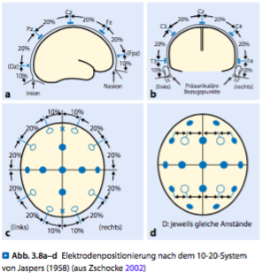

#####Elektrodenbezeichnungen
Jetzt wurde herausgefunden, wo **Cz** liegt, aber was bedeutet diese Bezeichnung? Jede Elektrode besteht aus Großbuchstaben, die die Lage über einem bestimmten Hirnareal bezeichnen (. Abb. 3.12).

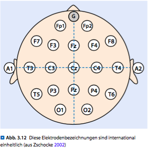

- F: Frontallappen,
- FP: frontopolar,
- T: temporal,
- C: zentral (Gyrus praecentralis), 
- P: parietal,
- O: okzipital

Neben den Großbuchstaben tragen die Elektroden eine Zahl in ihrer Bezeichnung, z. B. F3: 

- Ungerade Zahlen geben an, dass es sich um eine
Lokalisation auf der linken Hirnhälfte (Hemisphäre)
handelt, 
- gerade Zahlen beziehen sich auf die rechte Hemisphäre.

Die Elektrode F3 befindet sich also links auf dem Frontalkortex.

Eine weitere Lagebezeichnung ist der Wert der Zahl: Je
größer die Zahl ist, umso weiter liegt die Elektrode nach
außen zur Seite hin, nach „lateral“. Geht etwas zur Mitte
hin, nennt man dies nach „medial“.
Tragen die Elektroden ein kleines „z“ anstelle einer
Zahl, bedeutet es, dass die Elektrode genau über der Mittelinie
zwischen beiden Hirnhälften liegt, das „z“ steht für
Zero (engl. Null).

##Training der Selbstkontrolle der langsamen kortikalen Potenziale
Langsame kortikale Potenziale (Slow Cortical Potentials,
auch SCPs genannt) sind ereigniskorrelierte Potenziale
und können nicht mit den bereits beschriebenen Frequenzen
des EEG verglichen werden. Sie haben keine
Schwingungen im herkömmlichen Sinn, sondern sie bestehen
aus lang anhaltenden Verschiebungen des gesamten
EEG-Spektrums in eine elektrisch negative oder positive
Richtung. So etwas geschieht, wenn entweder viele Nervenzellverbände
gleichzeitig angeregt werden und sich dadurch
ihre Bereitschaft erhöht, zu feuern, oder wenn die
Aktivierung zurückgefahren wird und/oder bereitgestellte
Energie verbraucht wird.
Ereigniskorrelierte Potenziale entstehen als Antwort
des Gehirns auf äußere oder innere Reize.
Langsame kortikale Potenziale sind als ereigniskorrelierte
Potenziale Reaktionen des Gehirns auf äußere oder innere
Stimulationen. Während das Spontan-EEG das Abbild der
ständigen Gehirnaktivität ist, entstehen die ereigniskorrelierten
Potenziale als Antwort auf Reize, d. h., sie sind an
bestimmte Ereignisse zu einer bestimmten Zeit gebunden.
Weil diese Reaktionen sehr kleine Amplituden haben, gehen
sie im Rauschen des normalen EEGs unter, man kann
sie nicht identifizieren. Erst wenn man das EEG mittelt
(. Abb. 4.1), sind sie erkennbar. Dann kann man auch ganz
bestimmte Anteile (Komponenten) unterscheiden, die je
nach zeitlichem Auftreten und Polarität (negativer oder
positiver Ausrichtung) die Verarbeitung der Reize in bestimmten
Gehirnarealen widerspiegeln. Sie werden je nach
Entstehungsort in Hirnstamm- und kortikale Potenziale
unterteilt. Amplitude (Anteil an Energie, den die einzelnen
Komponenten haben) und Latenz (Zeitdauer bis zu ihrem
Auftreten) lassen Rückschlüsse auf die Verarbeitungsqualität
der Reize durch die verschiedenen Gehirnstrukturen
zu. So weiß man, dass bei Menschen mit ADS/ADHS die
Latenz bestimmter Komponenten länger ist, und dass ihre
Amplituden kleiner sind.

Beim SCP-Training wird die bewusste Kontrolle über den Aktivierungszustand des Gehirns erlernt.

Schlafstörungen und Kopfschmerzen lassen sich durch
SCP-Training abwenden.

Wer die SCPs kontrollieren kann, ist in der Lage, situationsgerecht
ganz gezielt Energie für die Informationsverarbeitung
zu mobilisieren.

Wenn man die Veränderungen in den Amplituden der
verschiedenen Frequenzen untersucht, bemerkt man, dass
sie oft spindelartig an- und abschwellen. Eine Verbindung
der Amplitudenspitzen ergibt eine Amplitudenhüllkurve,
auch Envelope genannt, die zu- und abnimmt.
Der Verlauf der langsamen kortikalen Potenziale
bestimmt die Amplitudenveränderungen aller Frequenzen.

##Infra Low Frequency (ILF-)Neurofeedback
###Wie funktioniert das ILF-Verfahren?
Das ILF-Training wurde von Sue und Siegfried Othmer
in den USA entwickelt, deshalb wird es auch häufig als
Othmer-Methode, bzw. Othmer-Verfahren, bezeichnet.
Das Training in den ganz niederen Frequenzen, also das
Infra Low Frequency (ILF-)Training, ist zwar Hauptbestandteil,
aber nicht alleiniges Werkzeug des Othmer-
Verfahrens. Das ILF-Training ist aus der klinischen Arbeit
heraus über die letzten 25 Jahre entstanden (▶ Abschn. 5.6,
„Entwicklung der Methode“). Es unterscheidet sich von den
zuvor beschriebenen Neurofeedbackverfahren hinsichtlich
der verwendeten Ableitungen, Elektrodenpositionierungen,
Feedbackparameter und Technik.
Beim ILF-Training wird nicht versucht, von bestimmten
Frequenzen willentlich mehr oder weniger zu produzieren,
sondern es geht vielmehr darum, dem Gehirn spezifische
Parameter aus dem niedrigen Frequenzbereich, wie in einer
Art Spiegel zu präsentieren, damit das Gehirn diese Information
sinnvoll nutzen kann, um den eigenen Erregungslevel
selbst besser zu regulieren. Dabei kommt es häufig
zu recht schnellen, spezifischen Zustandsänderungen beim
Patienten, die vom Therapeuten richtig interpretiert werden
müssen, um das Training für jeden einzelnen Patienten optimal
anzupassen. In dieser Hinsicht ist das ILF-Training
eine therapeutisch recht anspruchsvolle Arbeit.

####Technik
Die Entwicklung einer Methode hängt auch immer mit
der Entwicklung der verwendeten Technik zusammen.
Dazu zählt die gesamte Signalübertragung von den Elektroden
bis hin zur Darbietung des Feedbacks, also nicht
nur die Spezifikationen des EEG-Verstärkers, sondern
auch die Signalverarbeitung und Feedbacksteuerung in
der Software sowie die verwendeten Elektroden. Aufgrund
der klinischen Ergebnisse und Notwendigkeiten
wurde die Technik vor allem so weiterentwickelt, dass
mittlerweile auch die ganz langsamen Frequenzen mit
in das Training einbezogen werden können. Frühere
Techniken, die sich auf die klassischen Frequenzbänder
(Delta, Theta, Alpha, Beta) konzentrierten, und die
gängigen Spektralanalyseverfahren, wie z. B. die Fast-
Fourier-Transformation (FFT-)Analyse, konnten nur in
Frequenzbereichen >1 Hz sinnvoll verwendet werden.
Für darunter liegende Frequenzbereiche wurden Gleichspannungsverstärker
wie für die SCPs, die Slow Cortical
Potentials, benutzt.

Für das ILF-Verfahren wird nun eine Technik eingesetzt,
die selbst in den niedrigen Bereichen frequenzspezifisch
messen und rückmelden kann. Dafür eignet sich
die herkömmliche FFT-Analyse nicht mehr. Das Feedback
über die Zustandsänderungen im Gehirn würde viel zu
spät eintreffen. Aus diesem Grund werden beim ILFTraining
andere mathematische Verfahren zur Signalverarbeitung
eingesetzt, die das Auf und Ab des elektrischen
Signals viel direkter verfolgen. Eine weitere wichtige Anforderung
an die Technik und v. a. an die Software ist die
einfache Bedienbarkeit (. Abb. 5.2), damit der Therapeut
sich voll und ganz auf die therapeutische Arbeit konzentrieren
kann und nicht von der Technik überfordert wird.

####ILF-Belohnungsfrequenzen
Beim ILF-Training werden Belohnungsfrequenzen im Bereich
von 0,1–100 mHz verwendet (. Abb. 5.2). In diesen
niedrigen Bereichen stellt sich die Frage, ob der Begriff
Belohnungsfrequenz überhaupt noch passend ist.
Das Wort Frequenz wird historisch für die Einstellung
des Belohnungsbereichs verwendet.

Darunter darf man sich beim ILF-Training jedoch keine
Welle mit der eingestellten Frequenz vorstellen, denn
0,0001 Hz (= 0,1 mHz) wäre eine Welle mit einer Dauer von
fast 3 Stunden. Beim ILF-Training versucht das Gehirn vielmehr,
eine Balance zu halten, am besten vergleichbar mit
einem Surfer, der versucht, auf der Mitte der Welle zu bleiben,
wo seine Geschwindigkeit am größten wird. Kommt er
zu weit nach unten oder oben, wird er langsamer. Im ILFTraining
wird diese Balance in den Feedbackanimationen
durch die Geschwindigkeit von Rakete, Auto, Jet-Boot etc.
genau dargestellt. Ein Balanceakt ist immer ein Regelkreis,
der optimal eingestellt sein muss, damit die Balance gehalten
werden kann. Das Fahrradfahren bietet einen guten Vergleich:
Reagieren wir zu heftig auf eine Schieflage, fangen
wir an, hin und her zu schleudern und werden schließlich
stürzen. Reagieren wir zu wenig, werden wir auch umfallen.
Heftigkeit und Geschwindigkeit der Reaktion müssen also
genau stimmen, damit die Balance gehalten werden kann.

##Neuere Ansätze
###Live-Z-Score-Training(Echtzeit-Z-Wert-Training)
####Wie funktioniert Live-Z-Score-Training?
Das Z-Wert-Training wird seit den 1990er Jahren von
Dr. Robert W. Thatcher, einem amerikanischen Chemiker
und Neurobiologen, entwickelt und ist seit 2006 als Addon-
Datenbank für verschiedene Neurofeedbacksysteme
erhältlich.
Als Grundlage der Datenbank dienen die von Thatcher
für die statistische Auswertung der Neuroguide Datenbank (www.applied-neuroscience.com) erhobenen,
quantitativen EEG-Normwerte.
Die EEG-Daten von 600 Personen (Neugeborene bis
82 Jahre) ermöglichen während des Neurofeedbacktrainings
eine Echtzeitvergleichsmessung der EEG-Werte
des Patienten mit der Datenbank dieser Normpopulation.

Das bedeutet z. B.: - Bei einem Theta-Z-Wert von +2.0 liegen die Werte
des Patienten zwei Standardabweichungen über seiner
Altersnorm (Mittelwert), und - bei einem Beta-Wert von -2.0 liegen sie zwei Standardabweichungen
unter seiner Altersnorm.
Vor Beginn des Trainings muss der Therapeut das Alter
des Patienten, die Elektrodenpositionierung nach dem
10-20-System und die Durchführungsart des Trainings
(mit offenen oder geschlossenen Augen) festlegen, da es
hierfür analog zur Erfassung der QEEG-Daten unterschiedliche
Normwerte gibt.
Die Besonderheit beim Z-Wert-Training ist, dass parallel
zum Training bestimmter Amplitudenwerte (Absolute
Power, Relative Power, Power Ratios) zusätzlich die
Konnektivitätsmaße (Kohärenz, Phase, Asymmetrie) der
verschiedenen Positionen (z. B. Fz/Pz) trainiert werden
können, mit dem Ziel, die Zusammenarbeit dieser Hirnareale
zu verbessern: - Bei einem 4-Kanal-Z-Wert-Training (. Abb. 6.1) können
dann insgesamt 248 Echtzeitwerte gleichzeitig
trainiert werden, - bei einem aufwändigen 19-Kanal-Training bis zu
5.130 Werte.

Parallel zu den Z-Werten können zusätzlich die Amplituden
ausgewählter Frequenzbänder, z. B. Theta-Reduktion
oder Beta-Erhöhung an Cz trainiert werden, oder man
kann beim Frequenzbandtraining den Verlauf der Z-Werte
mit beobachten, ohne diese zu trainieren.

Bei der Echtzeitvergleichsmessung der EEG-Werte
des Patienten wird angegeben, wie viele Standardabweichungen
(SD) ein Rohwert vom Mittelwert einer
Stichprobe entfernt liegt, wobei der Mittelwert bei 0
und die Standardabweichung bei +/-1 liegt.

####Trainingsziel
Das Ziel des Z-Wert-Trainings liegt nicht im Erreichen
vorgegebener Normwerte, sondern in der dynamischen
Anpassung des Gehirns in Richtung dieser Normwerte,
also in der Flexibilisierung neuronaler Verarbeitung.

####Kontraindikationen
Das Z-Wert-Training ist nicht für ein Peak-Performance
Training geeignet, da hier z. B. eine erhöhte SMR-Aktivität
(= sensomotorische Rhythmusaktivität) an C3/C4
abweichend von der Norm einen gewünschten Trainingseffekt
darstellt.
Bei einer posttraumatischen Belastungsstörung
besteht die Gefahr, dass die für den Patienten wichtigen
Kompensationsmechanismen durch das Z-Wert-Training
reduziert werden.

###LORETA-Neurofeedback
####Wie funktioniert LORETA-Neurofeedback?
Bei einer EEG-Messung an der Schädeloberfläche erfasst
eine einzelne Elektrode immer elektrische Potenziale aus
vielen unterschiedlichen Hirnregionen, die dann an der
Hautoberfläche unter der Elektrode gemeinsam gemessen
werden. So erfasst z. B. die Cz-Elektrode ein Gemisch aus
Potenzialen, die ihren Ursprung in frontalen, temporalen,
okzipitalen und parietalen Regionen haben.
Mit LORETA (Low Resolution Brain Electromagnetic
Tomography; dreidimensionales elektromagnetisches
Gehirn-Bildgebungsverfahren in niedriger Auflösung)
wurde eine mathematische Methode entwickelt, mit der
es möglich ist, diese Mischung der elektrischen Quellen
zu entschlüsseln. LORETA erlaubt so eine dreidimensionale
Quellenanalyse der gemessenen EEG-Daten mit einer
Auflösung von weniger als einem Kubikzentimeter (zu den
mathematischen Details und Validierungen siehe Pascual-
Marqui et al. 1994, Pascual-Marqui 1999) (. Abb. 6.5).

Die für die Analyse der EEG-Daten erforderliche Software
(LORETA-Key) wurde von Roberto D. Pascual-Marqui
am KEY Institute for Brain-Mind Research (University
Hospital of Psychiatry, Zürich, Schweiz) entwickelt und ist
über die Institutshomepage erhältlich (www.uzh.ch/keyinst/
loreta.htm).
Aktuell verfügbare Versionen sind: - sLORETA (Standardized Low Resolution Brain Electromagnetic
Tomography) und - eLORETA (Exact Low Resolution Brain Electromagnetic
Tomography).

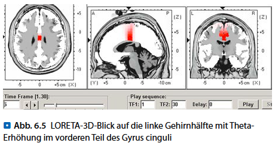

Die für die Analyse der EEG-Daten erforderliche Software
(LORETA-Key) wurde von Roberto D. Pascual-Marqui
am KEY Institute for Brain-Mind Research (University
Hospital of Psychiatry, Zürich, Schweiz) entwickelt und ist
über die Institutshomepage erhältlich (www.uzh.ch/keyinst/
loreta.htm).
Aktuell verfügbare Versionen sind: 

- sLORETA (Standardized Low Resolution Brain Electromagnetic
Tomography) und 
- eLORETA (Exact Low Resolution Brain Electromagnetic
Tomography).

#Nichtmedizinische Anwendung von Biofeedback und Neurofeedback
Die Anwendungsgebiete lassen sich dabei in die folgenden Kategorien
aufteilen, zumindest nach der momentan üblichen Verwendung: 

- Wellness, 
- Psychoedukation, 
- Prävention und 
- Peak Performance.

##Wellness
Auch hier wird hauptsächlich der Ansatz verfolgt, einem Klienten Methoden zur Entspannung zu vermitteln. Ein Alpha-Neurofeedbacktraining, also das kontrollierte Anheben der Alpha-Frequenzen des EEGs, wird auch mit dem Begriff der Entspannung in Verbindung gebracht.

##Psychoedukation
Beim Neurofeedback lässt sich auch ein Alpha-Training zur Demonstration von Entspannung gerade bei jugendlichen Patienten und Klienten einsetzen. Speziell der Begriff „chillen“, also das entspannte Genießen einer angenehmen
Lebenssituation, kann durch das Training bzw. das erfolgreiche Anheben der Alpha-Aktivität mit Leben gefüllt werden. Gleichzeitig kann Jugendlichen dadurch auch glaubhaft vermittelt werden, dass es, neben Alkohol und Drogen, auch bessere Möglichkeiten gibt, den psychischen Druck unangenehmer Situationen zu bewältigen.

##Prävention
Der Schwerpunkt der Neurofeedbackbehandlung lag auf der Verbesserung der mit Entspannung assoziierten Komponenten des EEGs. Trainiert wurde hauptsächlich eine Erhöhung des oberen Alpha-Bereichs (9–10 Hz), bei gleichzeitiger Reduktion der Beta-Anteile oberhalb von 18 Hz. Anfänglich war der Patient nicht in der Lage, die Alpha-Anteile zu erhöhen, auch nicht unter der Bedingung
mit geschlossenen Augen. 

Gleichzeitig kommt es durch das sogenannte CrowdFunding, bei dem Entwickler eine interessierte Gemeinschaft von potentiellen Benutzern um die Finanzierung
ihrer Produktidee bitten, zu einer preislichen Liberalisierung und einer erhöhten Verfügbarkeit mobiler Neuro- und Biofeedback Geräte. Beide Entwicklungen zusammen sorgen dafür das interessierten Personen und Behandlern (wie Coaches und Trainern) immer mehr Möglichkeiten zur Verfügung stehen, Biofeedback Trainingseinheiten direkt am Arbeitsplatz oder im Heimtraining durchzuführen. Zum Einen wird hierdurch auch das Behandlungsspektrum professioneller Biofeedback Therapeuten erweitert: Die Häufigkeit von Trainingseinheiten kann relativ kostengünstig deutlich erhöht werden. Speziell bei Behandlungen die von einem höheren Trainingsumfang profitieren könnten (

**Beispiel:**
Chronische Schmerzen) ist dieses Vorgehen sinnvoll, bei dem Sitzungen in der Praxis mit Heimtrainings-Einheiten kombiniert werden. Zum Anderen besteht natürlich auch die Gefahr, dass unerfahrene Benutzer durch ein ungeeignetes Training nur negative, keine oder nicht ausreichende positive Veränderungen
erreichen, und sich dann grundsätzlich wieder von der Methode Biofeedback entfernen. Was vermutlich bei einer entsprechenden fachlichen Einweisung unterblieben wäre, oder einen positiven Verlauf hätte nehmen können. Professionelle Behandler und entsprechende Fachverbände setzen sich daher zurzeit recht kritisch mit dem Thema „Neuro- und Biofeedback-Training ohne fachliche Anleitung“ auseinander. Unter Anderem auch weil die Gefahr wirtschaftlicher Einbußen besteht. Hier sollte allerdings der Grundsatz gelten, dass eine derartige Entwicklung zunächst einmal ein enormes Potential besitzt, dass Biofeedback Training von der Position eines ausschließlich alternativen Behandlungsverfahrens mehr auf die Position einer regulären Behandlung zu rücken. Insgesamt sollte daher ein entsprechender konstruktiver Dialog zwischen Herstellern, Therapeuten und Anwendern geführt werden.

##Peak Performance
Das Etikett „Peak Performance“ ist seit geraumer Zeit en
vogue, teilweise werden hier geradezu Wunderleistungen von Trainingsmaßnahmen erwartet. Es scheint also angebracht, sich dem Begriff durch eine differenzierte Betrachtung zu nähern. Unter Peak Performance wird eine Spitzenleistung verstanden, die auf einem bereits hohen Leistungsniveau aufsetzt. Zur Erreichung dieser Spitzenleistung wird u. a. eine Vielzahl von Protokollen und Modalitäten des Biofeedbacks eingesetzt.

Zum Peak Performance-Training mittels Biofeedback gehört auch die sorgfältige Analyse aller Umgebungsvariablen, die im Umfeld der Spitzenleistung
eine Rolle spielen. Effektive Pausen sind oft der Schlüssel zum Erfolg.

##Fazit
Gerade im Bereich der Prävention genügt es oft, dem Klienten grundlegende psychophysiologische Zusammenhänge zu verdeutlichen, z. B. den Zusammenhang zwischen physiologischem Stress und einer eingeschränkten Leistungsfähigkeit verständlich zu machen.

Beim Neurofeedback wird Entspannung hauptsächlich über eine Anhebung der EEG-Aktivität im Alpha-Frequenzband (8–12 Hz) trainiert, evtl. in Kombination
mit dem Absenken von Beta-Komponenten (18–30 Hz), speziell, wenn dieser Aktivitätsbereich überproportional dominant ist. Für die peripherphysiologischen Biofeedbacksignale gilt Ähnliches, hier wird der Fokus z. B. auf die Entspannung der Muskulatur oder die Kennzeichen einer vertieften Atmung gelegt.

Insgesamt ist es empfehlenswert, sich „vorurteilsfrei“ der Literatur aus anderen Bereichen der Gesundheitsbehandlung zu nähern, wie sie u. a. im Yoga oder in der Meditationslehre zu finden sind. Das Repertoire der zur Verfügung stehenden Methoden, die einem Klienten helfen können, gelernte Techniken des Biofeedbacks in alltagstaugliches Verhalten umzusetzen, kann so ständig erweitert werden. Gerade in der Kombination mit den Techniken der Verhaltensmodifikation aus dem Yoga kann eine der Stärken des Biofeedbacks bewusst eingesetzt werden: unmittelbar sichtbar zu machen, welche physiologische Wirkung die Veränderung von Verhaltensweisen und Denkmustern bewirken kann.

#Biofeedback und Neurofeedback in der Praxis: Fallbeispiele
Dieses Kapitel soll einen Überblick geben, wie und in
welchem Umfang Biofeedback und Neurofeedback im
Rahmen der Behandlung verschiedener Störungsbilder
eingesetzt werden können.

##Psychische Störungen in der Kindheit und Adoleszenz
###Aufmerksamkeitsdefizitstörung mit oder ohne Hyperaktivität (ADS/ADHS)
####Erklärungsmodell
ADS/ADHS zeichnet sich durch drei Hauptsymptome
aus, durch Störungen 

- der Aufmerksamkeit, 
- der Impulskontrolle und 
- der Aktivität.

Während die Kinder im Kindergarten hauptsächlich durch
ihr unruhiges Verhalten auffallen, werden in der Grundschule
die Aufmerksamkeitsstörungen deutlich, gekoppelt mit den Schwierigkeiten, die durch die körperliche Unruhe und die mangelnde Impulskontrolle verursacht werden.  
Bei annähernd zwei Dritteln der Kinder treten Komorbiditäten
auf, wie 

- Legasthenie, 
- Dyskalkulie, 
- Depression, 
- Zwangsstörungen, 
- Angststörungen (vermehrt bei Mädchen mit Aufmerksamkeitsdefiziten)

und als häufigste Komorbidität - Störungen des Sozialverhaltens wie z. B. oppositionelles Verhalten. 

Viele der zusätzlichen Störungen werden oft nicht erkannt, weil das hyperaktive und oppositionelle Verhalten vermehrt von der Umwelt wahrgenommen wird. So werden Ängste und depressive Symptome übersehen. Das Selbstbewusstsein dieser Kinder leidet, da sie sich immer wieder als Versager erleben, als ausgegrenzt, gerügt, ermahnt, nur selten gelobt.  
Nicht immer sind die Eltern in der Lage, die notwendige emotionale Unterstützung und Geborgenheit zu vermitteln. Häufig ist mindestens ein Elternteil ebenfalls von ADS/ADHS betroffen und kann die notwendige Strukturierung des Alltags nicht erbringen. So ist das Kind auf sich selbst gestellt und entwickelt oft genug dysfunktionale Kompensationsmechanismen. Dies kann zu erheblichen Einschränkungen in der Lebensqualität führen.

Bis zu 85 % der diagnostizierten Kinder zeigen auch als Jugendliche ADHS-typische Verhaltensweisen. Bei Jugendlichen und Erwachsenen tritt die Hyperaktivität zwar in den Hintergrund, kann aber in Form einer andauernden inneren Unruhe weiterbestehen. Die Aufmerksamkeitsstörung verhindert oft, dass die Betroffenen trotz guter Intelligenz den Anforderungen einer höheren Schule oder eines Studiums genügen. Bei Erwachsenen ist das Störungsbild ganz unterschiedlich. Mangelnde Impulskontrolle, Unordnung, Probleme mit der Zeiteinteilung, schlechte Organisation, fehlerhafte Ausführung von Arbeiten, Schwierigkeiten mit Regeln verursachen große Probleme bei der Arbeit
und im sozialen Bereich.

####Methoden und Therapieziele
Am besten wird ADS/ADHS mit einem multimodalen Ansatz behandelt, der neben Bio- und Neurofeedbacktraining auch Verhaltenstraining, Elternschulung, Instruktion von Lehrern und Selbstinstruktionstraining umfasst. Doch hat sich herausgestellt, dass auch bei Kindern, deren Eltern nicht in der Lage sind, ein Elterntraining erfolgreich umzusetzen, Bio- und Neurofeedback trotzdem wirkungsvolle Behandlungsmethoden sind.

Biofeedback und Neurofeedback führen zu Selbstregulation
und dem Erleben von Selbstwirksamkeit.

####Traditionelle Verfahren
Traditionelle Verfahren sind das Theta-Beta-Training
und das SMR-Training. Biofeedbackverfahren wie Herzratenvariabilitätstraining sind bei den Kindern sehr beliebt und effektiv. Bei manchen, sehr angespannten Kindern und auch Erwachsenen ist es sinnvoll, vor dem eigentlichen Neurofeedbacktraining ein HRV-Training oder ein EMG-Training vorzuschalten, damit sie ruhiger und gelöster werden. Ohne dass die Kooperation der Eltern
zwingend notwendig ist, führen Bio- und Neurofeedbacktraining zu einer Verbesserung des Arbeitsgedächtnisses, der Handlungsplanung und der Problemlösungsfähigkeit. Fortschritte in der Aufmerksamkeit führen zu Erfolgen in Schule und Beruf. Die erhöhte Impulskontrolle ermöglicht bessere soziale Kompetenzen, hieraus ergeben sich stabilere soziale Kontakte und eine verbesserte Teilhabe in allen Bereichen.

Die Fortschritte ermöglichen eine effektivere Anpassung
an die Anforderungen der Umwelt.

####Behandlungsverlauf
Nach 30 Neurofeedbacksitzungen hat sich Timos Verhalten
deutlich verbessert. Er schreibt in letzter Zeit nur noch gute Noten und freut sich wie ein Schneekönig darüber. Vor Kurzem schrieb er die beste Mathematikarbeit der ganzen Klasse. Plötzlich hat er entdeckt, dass er etwas kann, und das motiviert ihn. Die Auswirkungen des Neurofeedbacktrainings auf die Frequenzbänder zeigen, dass sich die Amplituden der schnellen Wellen erhöht
haben (. Abb. 9.1a), während für die langsamen Wellen wie Theta (4–7 Hz) und Thalpha (6–10 Hz) (. Abb. 9.1b) weniger Energie aufgebracht wird und deren Amplituden demnach im Behandlungsverlauf kleiner werden. Der Theta-Beta-Quotient sinkt um fast die Hälfte (. Abb. 9.1c). Seine Lehrerin berichtet, er sei viel wacher und interessierter und könne nun wertvolle Beiträge zum Unterricht bringen. Bei der Behandlung ist er offener und erzählt von seinem Alltag. Während er früher eher ein griesgrämiges Gesicht machte,
zeigt er sich jetzt fröhlich und offen.

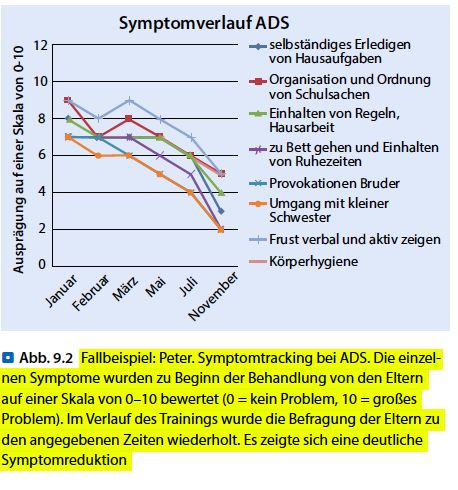

####Frequenzbandtraining bei AD(H)S
Bei Kindern mit AD(H)S zeigt sich (auch wenn es sich nicht immer um ein einheitliches physiologisches Muster handelt) bei einem Großteil der Kinder – im Vergleich zu Kindern gleichen Alters, gleichen Geschlechts, gleichen Bildungsstatus etc. ohne Aufmerksamkeitsstörung – folgendes Bild: Besonders unter mentaler Belastung zeigt sich im Spontan-EEG ein zu hoher Theta-Anteil (bedingt durch die Amplitude) in Relation zu den Low-Beta-Anteilen. Dies zeigt sich in einer erhöhten Theta-Beta-Ratio. Eine hohe Aktivität im Bereich der Theta-Wellen in Relation zu den Beta-Wellen steht eher für eine nach „innen gerichtete “Aufmerksamkeit, die Aufmerksamkeit nach außen ist eingeschränkt bis massiv blockiert. Das Gehirn arbeitet zu langsam, um eine geforderte mentale Leistung bringen zu können. Informationen werden nicht oder nur unvollständig aufgenommen, verarbeitet und abgespeichert.

Hohe Amplituden von Theta-Wellen (im Verhältnis zu den Amplituden der Beta-Wellen, Ratiobildung) können die nach außen, auf die Umwelt gerichtete
Aufmerksamkeit stören. Das Ziel des Neurofeedbacktrainings (ca. 20 Sitzungen) ist es zunächst, dass die Patienten es schaffen, - die Intensität der Lo-Beta-Wellen zu steigern und über einen individuell bestimmten Schwellenwert zu erhöhen, und gleichzeitig - die Theta-Wellen unter einen individuellen Schwellenwert zu verringern. Damit es nicht zu einer Hyperfokussierung oder einer scheinbaren Steigerung der Lo-Beta-Aktivität durch Muskelanspannung
kommt, ist es sinnvoll, den High-Beta-Anteil oder den Muskelanteil (meist abgebildet durch den Artefakt-Wert) ebenfalls abzusenken. Immer dann, wenn
dies dem Patienten gelingt, gibt es ein positives Feedback, auditiv oder visuell.

Zunächst ist es sinnvoll, dass das Feedback motivierend ist, beispielsweise wird ein Video-Comic gesteuert oder ein Film mit einem für den Patienten motivierenden Inhalt.

- Theta unterhalb der Schwelle (4–7 Hz), 
- Lo-Beta (15–20 Hz) oberhalb der Schwelle (ggf. SMR, 12–15 Hz) und 
- High-Beta (20–30 Hz) bzw. Artefakt unterhalb der Schwelle.

###Autismus-Spektrum-Störung (ASD)
####Erklärungsmodell
Die Prävalenz für Autismus-Spektrum-Störungen wird mit 6/1.000 Kindern angegeben. Dabei ist diese Störung durch drei Hauptsymptomgruppen charakterisiert: 

- Störung der sozialen Interaktion, 
- Störung der Kommunikation, 
- stereotype und eingeschränkte Verhaltensmuster und Interessen.

Bis heute gibt es noch keine ausreichende Therapie für ASD, weder pharmakologisch noch psychotherapeutisch. Nur etwa ein Viertel der Betroffenen ist in der Lage, ein unabhängiges Leben zu führen, die anderen sind lebenslang
auf Hilfe angewiesen. Erst in letzter Zeit wird diese Störung neurophysiologisch erforscht. Dabei wurden gestörte Informationsverarbeitungsvorgänge in Beziehung zu der Kernsymptomatik gefunden. Interessant und passend zu der Erkenntnis, dass bei ASD auch viele Symptome von ADHS gefunden werden, ist die Tatsache, dass bei beiden Störungen eine Fehlfunktion des Default Mode-Netzwerks vorliegt.

####Methoden und Therapieziele
Neurofeedback bei ASD zielt entsprechend des dargestellten Erklärungsmodells darauf ab, die Aktivität des Default Mode-Netzwerks zu verstärken. Durch diese positive Beeinflussung sollen speziell das Sozialverhalten und die Abstraktionsfähigkeit, die oft auch als Metakognition bezeichnet wird, gesteigert werden.

Neurofeedback kann die Kernsymptomatik der Autismus-Spektrum-Störung positiv beeinflussen.

Man muss bei Menschen mit Autismus mit mehr Sitzungen rechnen als bei ADHS.

##Angststörungen
###Angststörungen und Panikattacken
####Erklärungsmodell
Wenn bei einer psychischen Störung eine unspezifische
Angst oder wie bei der Phobie eine konkrete Furcht vor
Objekten und Situationen im Mittelpunkt der Symptomatik
steht, spricht man von einer Angststörung. Die Angst,
als weitgehend normaler Affekt des individuellen Überlebens,
hat sich dabei im Rahmen der Störung verselbständigt.
Bezogen auf die Kriterien Intensität, Fortbestehen,
Bewältigung und den subjektiven und körperlichen Beeinträchtigungsgrad
unterscheidet sich die Symptomatik von
der „normalen“ Angst bzw. dem Empfinden gesunder Personen.
Dazu gehört auch, dass die körperlichen Symptome
einer solchen Reaktion (z. B. Steigerung von Blutdruck und
Herzrate, Schweißdrüdenaktivität, Gedankenrasen, Änderung
der Hauttemperatur) unangemessen stark ausgeprägt
sind. Diese starke Veränderung wird aufgrund eines
konditionierten Vermeidungsverhaltens (Vermeiden von
angstbesetzten Situationen) von den betroffenen Personen
meist frühzeitig wahrgenommen und kann dann selbst
wiederum einen weiteren negativen Schub der Angstreaktion
bewirken: Der sog. Teufelskreis der Angst oder das
Phänomen Angst vor der Angst entsteht.

###Phobien
####Methoden
Der Einsatz von Neurofeedback bei Personen mit Angststörungen
basiert darauf, dass die Hirnaktivität dieser Personen
bei direkter oder imaginierter Konfrontation mit
dem phobischen Reiz von High-Beta-Wellen dominiert
wird, gleichzeitig zeigt sich beim „Denken an den Reiz“ mit
geschlossenen Augen die Aktivität der Alpha-Wellen sehr
gering. Anstelle einer Entspannungsreaktion zeigt sich also
ein erhöhtes Erregungsniveau. Dieses erhöhte Erregungsniveau
zeigt sich auch an den peripher physiologischen Parametern
(z. B. EDA). Wird dies von den Betroffenen als
sehr unangenehm empfunden, kommt es nicht selten zur
Vermeidung des auslösenden Stimulus.

Ein hohes physiologisches Erregungsniveau in Verbindung
mit einem phobischen Reiz zeigt sich im EEG
in hohen Anteilen von High-Beta-Wellen. Wird dies
vom Patienten als unangenehm empfunden, führt
Vermeidung zu einer Reduktion der Erregung.

###Posttraumatische Belastungsstörung (PTBS)
####Erklärungsmodell
Laut Definition der WHO gehen einer PTBS ein oder mehrere belastende Ereignisse von außergewöhnlicher Bedrohung oder katastrophenartigem Ausmaß voran. Vereinfacht gesagt wird der Organismus in kürzester Zeit mit einer Fülle von Reizen und emotionalen Reaktionen überflutet, die in der Regel nicht im adäquaten Umfang verarbeitet werden können: Nachfolgend findet eine fortdauernde Beeinträchtigung der Verarbeitungskapazität statt, die ein Trauma begründet. Die eigentliche Bedrohung muss nicht unbedingt die eigene Person betreffen, sondern kann auch miterlebt oder beobachtet werden (z. B. wenn man Zeuge eines schweren Unfalls oder einer Gewalttat wird). Die PTBS tritt in der Regel innerhalb von einem halben Jahr nach einem traumatischen Ereignis auf. Sie geht mit unterschiedlichen psychischen und psychosomatischen Symptomen einher, beispielsweise kommt es häufig zu einem Gefühl von Hilflosigkeit sowie zu einer gravierenden negativen Beeinträchtigung des Selbstverständnisses. Bei der Behandlung einer PTBS sollten die folgenden grundsätzlichen Überlegungen aus der Verhaltenstherapie beachtet werden: 

- Zumeist ist erst eine Phase der Stabilisierung notwendig,
bevor weitere spezielle Techniken eingesetzt
werden können. 
- Wird der Betroffene von den Erlebnissen der Traumatisierung
regelrecht überwältigt, und erlebt er
dabei heftige Emotionen (Intrusion), sollte die direkte
Konfrontation mit dem traumatischen Erlebnis
zunächst unterbleiben. Hier steht die Unterstützung
hinsichtlich des Umgangs mit den intrusiven Erinnerungen
im Vordergrund der Behandlung. 
- Wird der Betroffene weniger stark und häufig von
dem Erlebten überwältigt, kann es sinnvoll sein,
direkt mit dem traumatischen Erlebnis zu arbeiten. 
- Ist das Trauma bearbeitet, ist es oft nötig, mit psychotherapeutischer
Unterstützung eine Neubewertung
und Umorientierung der eigenen Lebensumstände
anzugehen (www.de.wikipedia.org/wiki/Posttraumatische_
Belastungsstörung).

####Methoden
Die Erinnerung an das traumatische Geschehen wird in den Phasen des Erinnerns zumindest teilweise neu konstruiert, und hängt damit auch unmittelbar vom körperlichen und kognitiven Erregungszustand der aktuellen Situation ab. 

####ILF-Training bei PTBS
In den USA wird ILF-Training in einigen Militärbasen zur Nachsorge der aus den Kriegsgebieten zurückkehrenden Soldaten eingesetzt. In diesen Projekten wurden Daten von über 400 Soldaten mit PTBS gesammelt, und die Methode wurde im April 2011 bei der COSC Konferenz (Combat and Operational Stress Control) in San Diego, Kalifornien, von zwei klinischen Psychologen vorgestellt (einen Ausschnitt von dem Vortrag gibt es in einem Video unter <www.youtube.com/watch?v=Cb3fbriq2SU>

PTBS kann als Fehlregulierung im ZNS betrachtet werden, ausgelöst durch traumatische Ereignisse. Die Aufgabe des ILF-Trainings ist es in erster Linie, das gestresste Nervensystem wieder zu beruhigen und zu stabilisieren, die Angst zu bewältigen, um ein stabile Grundlage zur Bewältigung des Traumas zu schaffen. Dies kann mit anschließendem Alpha-Theta-Training und nach Stabilisierung des Nervensystems mit etablierten psychotherapeutischen Methoden sehr viel leichter erreicht werden als im fehlregulierten, gestressten Gehirn. Bei PTBS ist von einer Übererregbarkeit des Nervensystems auszugehen, deshalb wird mit dem Training zunächst auf der rechten Seite bei T4-P4 mit der niedrigsten Frequenz begonnen.

####Frequenzbandtraining bei PTBS
Bei Personen mit bestimmten psychischen Auffälligkeiten, wie z. B. Angststörungen, weist das EEG Charakteristika auf, die als Korrelat der Symptome angesehen werden können. Beispielsweise zeigen Patienten mit Angststörungen eine Hirnaktivität, die u. a. von High-Beta-Wellen dominiert wird. Häufig ist gleichzeitig die Aktivität der Alpha-Wellen sehr gering; dies zeigt sich oftmals besonders, wenn die Augen geschlossen werden. Anstelle einer Entspannungsreaktion zeigt sich also ein erhöhtes Erregungsniveau. Bei Patienten mit posttraumatischen Belastungsstörungen können zudem kurzfristig hohe Amplituden im Bereich der Theta- Wellen verzeichnet werden, die mit dem Auftauchen von Intrusionen zusammenhängen.   Eine hohe Aktivität im Bereich der Theta-Wellen steht für eine nach „innen gerichtete“ Aufmerksamkeit, im Sinne einer vermehrten oder leichteren Abrufbarkeit von Erinnerungen, wodurch das vormals erlebte traumatische Geschehen wieder lebendig wird. 

##Affektive Störungen
###Depressionen
####Methoden
Ein relativ neuer Ansatz in der Behandlung von Depressionen folgt der Ansicht von Emotionsforschern, dass depressive Befindlichkeitsstörungen, also das verminderte Erleben angenehmer Gefühle, mit einer reduzierten Aktivität von Regionen im linken Frontalhirn in Verbindung stehen, im Vergleich zur Aktivität im rechten Frontalhirn. Beispielsweise weisen bei betroffenen Personen die Alpha- und Beta- Anteile des EEGs dauerhaft eine entsprechende Asymmetrie auf: Die linke Hirnhälfte zeigt mehr Alpha und weniger Beta als die rechte Hirnhälfte. Durch ein entsprechendes Neurofeedbackprotokoll soll diese Asymmetrie in der hirnelektrischen Aktivität in ihrer Ausprägung und Richtung verändert werden, so dass daraus eine positive Befindlichkeit resultiert. 

Eine frontale Asymmetrie (Alpha links >Alpha rechts) kann als neuronales Korrelat einer depressiven Symptomatik angesehen werden. Das Ziel des Neurofeedbacktrainings ist es, die frontale Asymmetrie auszugleichen und die linke Hemisphäre zu aktiveren bzw. die rechte zu hemmen. Dazu wird das sog. A-Score-Training durchgeführt. Als Grundlage für den AScore dient folgende Formel (R = Alpha-Amplitude rechts, L = Alpha Amplitude links): 

    A-Score = (R - L)/(R + L)×100 

Die Aussage des A-Scores ist: 

- A-Score <0 = links mehr Alpha als rechts 
- - A-Score >0 = rechts mehr Alpha als links (gewünscht) 

##Chronische Schmerzen
###Migräne
####Erklärungsmodell
Pro Tag treten in Deutschland ca. 350.000 Migräneanfälle auf, berichtet die Deutsche Migräne und Kopfschmerzgesellschaft. Bei der Migräne handelt es sich um eine multifaktorielle und uneinheitliche Erkrankung, die familiär gehäuft auftritt. Es wird allgemein angenommen, dass die Migräne eine typische Frauenkrankheit sei. Das stimmt jedoch nicht, bis zu 40 % der Migräniker sind Männer. Fast 10 % der Bevölkerung leiden unter Migräne, etwa 15 % der Frauen und 7 % der Männer.

Die Ursachen der Migräne sind nicht vollständig erforscht. Da viele Migräniker Schmerzen im Nacken angeben, wird dort oft nach der Ursache gesucht, Fakt ist jedoch, dass der sog. zervikogene Kopfschmerz sehr selten ist. Im Migräneanfall ist der Trigeminusnerv gereizt, der nicht nur das Gesicht, sondern auch den Nacken sensibel versorgt.

Wie die Reizung des Trigeminus beginnt, weiß man noch nicht: 

- Man geht zum einen von einem neurochemischen Ungleichgewicht aus. Eine neurogene Entzündung um die Gefäße der basalen Hirnhäute führt zur Ausschüttung bestimmter Substanzen (u. a. Calcitonin Gene Related Peptide), die den Trigeminus reizen und die Gefäße erweitern. Dies führt zu einer weiteren Ausschüttung dieser Substanzen, und ein Teufelskreis beginnt. 
- Zum anderen haben Studien gezeigt, dass Migräniker eine veränderte kortikale Anpassungsfähigkeit haben. Sie zeigen auch zwischen den Anfällen eine Überempfindlichkeit gegenüber sensorischen Reizen, die sich im Anfall noch verstärkt, so dass die Betroffenen sich am liebsten ins dunkle Zimmer zurückziehen, wo sie auch vor Geräuschen geschützt sind. 

Menschen, die an Migräne leiden, haben eine erniedrigte Schwelle für sensorische Reize.

Stimulationen, die von Menschen ohne Migräne problemlos verarbeitet werden, sind für Migräniker schon in der Phase zwischen den Anfällen zu heftig, weil sie ihre Reizschwelle nicht anpassen können. Normalerweise gewöhnt sich das Gehirn an wiederholte Reize (Habituation), Menschen mit Migräne jedoch reagieren immer empfindlicher. Es scheint, als würde sich im Laufe der Zeit eine immer größer werdende kortikale Erregung aufbauen. 

Patienten mit Migräne (oder anderen Instabilitäten)
reagieren oft sehr empfindlich auf Frequenzänderungen!

####Behandlungsverlauf
Frau P. erscheint 1-mal pro Woche zum Neurofeedbacktraining. In der 1. Sitzung wird aufgrund der vielen Instabilitäten (Migräne, Schwindel, Panikattacken) und des Tinnitus bei T3-T4 mit 0,1 mHz begonnen. Bei der 2. Sitzung nach 1 Woche berichtet die Patientin, sie habe keine Kopfschmerzen mehr gehabt, allerdings habe sie vermehrt Schwierigkeiten, einzuschlafen und einen hohen Puls.

###Spannungskopfschmerz
####Erklärungsmodell
Man spricht von einem Spannungskopfschmerz, wenn es sich bei den Kopfschmerzen um Schmerzen im Bereich des gesamten Kopfes (beidseitig/über den ganzen Kopf verteilt) handelt, die eine drückend-ziehende, jedoch nicht pulsierende Charakteristik haben. Es sollte sich dabei um leichte bis mittelschwere Schmerzen handeln, die duch körperliche Aktivität nicht verstärkt werden. Die einzelne Kopfschmerzattacke hat eine Dauer zwischen 30 Minuten und 7 Tagen. Die genaue Entstehung des Spannungskopfschmerzes ist noch nicht eindeutig geklärt. Es kommen mehrere Faktoren infrage, die miteinander wechselwirken können: Beispielsweise kann eine unphysiologische Verkrampfung der Nackenmuskulatur, unter anderem ausgelöst durch kognitive Anstrengung, zu einer Aktivierung von Schmerzrezeptoren führen. Durch diese andauerende Aktivierung kann das zentrale schmerzverarbeitende System im ZNS dauerhaft sensibiliert werden, wodurch Schmerzen dann leichter wahrgenommen werden. Auch fieberhafte Infekte und Stress können Auslöser bzw. verstärkende Faktoren darstellen. Eine weitere Ursache können verspannte Kaumuskeln sein – Stichwort: Beiß doch mal die Zähne zusammen!

##Neurologische Störungen
###Epilepsie
####Erklärungsmodell
Epilepsie ist eine der häufigsten neurologischen Erkrankungen. Wie die World Health Organisation (WHO) berichtet, leiden weltweit 50 Millionen Menschen an Epilepsie. Bei der Mehrzahl der Patienten ist eine medikamentöse Behandlung erfolgreich. Von denen, die medikamentös nicht anfallsfrei werden und sich einer Operation unterziehen, erleben viele einen Rückfall. Insgesamt geht man davon aus, dass 20–30 % der Patienten an einer therapierefraktären Epilepsie leiden. Es gibt nicht „die Epilepsie“ an sich, sondern viele verschiedene Erscheinungsformen, deren Ursprung nicht vollständig geklärt ist. Allen gemeinsam sind immer wiederkehrende Anfälle, die durch überschießende elektrische Aktivität im Gehirn verursacht werden.

####Methoden und Therapieziele
Für die Patienten, bei denen weder Medikamente noch eine Operation helfen, ist Neurofeedback eine Möglichkeit, doch noch anfallsfrei zu werden oder zumindest die Häufigkeit der Anfälle zu reduzieren. Hier stehen ein Training des sensomotorischen Rhythmus mit oder ohne gleichzeitige Unterdrückung der langsamen Theta-Wellen, ein ILF-Training oder ein SCP-Training zur Verfügung. 

Schon seit 40 Jahren wird Neurofeedback erfolgreich bei der Epilepsiebehandlung angewandt.

SMR wird über mindestens 20 Sitzungen (12–15 Hz)
an C3 oder C4 erhöht und Theta (3–5 Hz) an Fz verringert.

###Schlaganfallrehabilitation
####Erklärungsmodell
Nach einem Schlaganfall müssen die Patienten viele
Dinge, die vor dem Ereignis vollkommen selbstverständlich
funktionierten, wieder neu lernen. Je nach Lokalisation
und Ausprägung des Schlaganfalls kann es zu unterschiedlichen
Funktionseinbußen kommen. In der Regel
wird durch den Schlaganfall Nervengewebe zerstört, und
die Funktionen der zerstörten Bereiche müssen von anderen
gesunden Bereichen im Gehirn übernommen werden.
Diese Fähigkeit des Gehirns, dass sich neuronale
Netzwerke in Abhängigkeit der Funktion verändern und
andere Aufgaben übernehmen, wird als Neuroplastizität
bezeichnet.

####Methoden und Therapieziele
Neurofeedback ist bestens geeignet, die Neuroplastizität im Gehirn zu unterstützen und das Wiedererlernen der ausgefallenen Funktionen zu erleichtern. Hauptaufgabe des Neurofeedbacktrainings ist es, das Gehirn durch eine bessere Regulationsfähigkeit des Erregungslevels und der Erregbarkeit in einen Zustand zu bringen, indem optimal gelernt werden kann. Denn sowohl zu hohe als auch zu niedrige Erregung schalten höhere Hirnfunktionen aus und erschweren Lernprozesse. In der Schlaganfallrehabilitation ist es wichtig, den Patienten einerseits genügend zu fördern, um die Prozesse der Neuroplastizität zu fördern, und andererseits nicht zu überfordern, was i. d. R. zu einem Zustand zu hoher Erregung oder Erschöpfung führt und Lernprozesse hemmt. Neurofeedbacktraining kann dazu beitragen, dieses Gleichgewicht besser zu halten und nicht zu schnell in Zustände zu hoher oder zu niedriger Erregung abzugleiten.

###Tinnitus
####Erklärungsmodell
Tinnitus, die Wahrnehmung von Geräuschen ohne Geräuschquellen in der Umgebung, ist häufig. Zur Prävalenz des Tinnitus berichtet die Deutsche Tinnitus Liga, dass beinahe 3 Millionen Menschen in der Bundesrepublik Deutschland an Tinnitus leiden. Die meisten nehmen den Tinnitus wahr, empfinden ihn aber als nicht weiter störend. Doch etwa 800.000 Menschen sind so schwer betroffen, dass sie intensive ärztliche Hilfe brauchen. Pro Jahr sind etwa 270.000 Neuerkrankungen zu verzeichnen. Eine Untersuchung der Deutschen Tinnitus Liga ergab, dass um die 10 % der Erwachsenen Ohrgeräusche haben, die länger als 5 Minuten anhalten, 7 % davon einen Arzt konsultieren und 4 % ihre Ohrgeräusche als schwere Belastung empfinden. Die Ursachen des Tinnitus sind vielfältig und bei einer großen Anzahl der Betroffenen mit Funktionsstörungen des Hörsystems, aber auch im Bereich der Halswirbelsäule und des Kiefers verbunden. Auch Medikamente können einen Tinnitus verursachen, der nach Beendigung der Einnahme wieder verschwindet, manchmal aber auch irreversibel ist. Zu weiteren Ursachen, die allerdings selten sind, gehören Hirntumoren, degenerative Hirnabbauprozesse, Schädel- Hirn-Trauma, Schlaganfall und Multiple Sklerose. Eine wichtige Ursache sind Lärmschädigungen, die heute immer mehr zunehmen. Bei Menschen mit Hörschädigungen kommt im Vergleich zu Gesunden viel häufiger ein Tinnitus vor.

####Alpha-Beta-Training bei Tinnitus
Da Tinnituspatienten im Vergleich zu Gesunden eine erhöhte Beta- und erniedrigte Alpha-Aktivität zeigen, während sie die Ohrgeräusche hören, erscheint es sinnvoll, ein entsprechendes Frequenzbandtraining durchzuführen.

